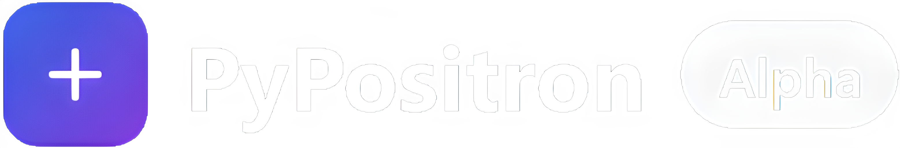

<p align="center">

</p>

# PyPositron
### **PyPositron is currently in alpha stage.** It is not yet ready for production use, but you can try it out and contribute to its development. See more in [Contributing](#contributing).
**PyPositron** is a Python-powered desktop app framework that lets you build cross-platform apps using HTML, CSS, and Python—just like Electron, but with Python as the backend. Write your UI in HTML/CSS, add interactivity with Python, and run your app natively!

**PyPositron has launched on Product Hunt! Upvote the product so it can be the product of the day.**

<a href="https://www.producthunt.com/products/pypositron?embed=true&utm_source=badge-featured&utm_medium=badge&utm_source=badge-pypositron" target="_blank"></a>


## Features

- Build desktop apps using HTML and CSS.
- Use Python for backend and frontend logic. (with support for both Python and JS)
- Use any web framework (like Bootstrap, Tailwind, React, etc.) for your UI.
- Use any HTML builder UI for your app (like Bootstrap Studio, Pinegrow, etc)
- Use JS for compatibility with existing HTML/CSS frameworks.
- Use AI tools for generating your UI without needing proprietary system prompts- simply tell it to generate HTML/CSS/JS UI for your app.
- Virtual environment support.
- Efficient installer creation for easy distribution (that does not exist yet)
(The installer automatically finds an existing browser instead of installing a new one for every app like Electron.JS).

## Why PyPositron?
Compared to Electron and other Python frameworks (like PyQt)-
| Feature | PyPositron | Electron | PyQt |
|---------|------------|----------|------|
| Language | Python | **JavaScript, C, C++, etc** | Python |
| UI Frameworks | **Any web technologies** | **Any Web technologies** | Qt Widgets |
| Packaging | **Efficient installer or standalone executable (not yet implemented)** | Electron Builder | PyInstaller etc |
| Performance | **Lightweight** | Heavyweight | **Lightweight** |
| AI Compatibility | **Yes** | **Yes\*** | No\* |
| Compatibility | **All frontend and backend HTML/CSS/JS frameworks and web technologies** | **All frontend and backend HTML/CSS/JS frameworks and web technologies** | Limited to Qt |

\* maybe

## Quick Start

### 1. Create a New Project
Install PyPositron if not already installed:
```bash
pip install py-positron 
```
Them create a new project using the CLI:
```bash
positron create
# Follow the prompts to set up your project
```
There should be directories in this structure-

```
your_app/
├── backend
│   └── main.py
├── frontend/
│   └── index.html
├── [win/linux]venv/ # If created
│   └──...
├── LICENSE #MIT by default
├── config.json
└── ...
```

- **backend/main.py**: Entry point for your app. 
- **frontend/index.html**: Your app's UI (HTML/CSS/inline Python/JS). 
- **winvenv/** or **linuxvenv/**: (Optional) Virtual environment for dependencies.

### 2. Run Your App

```bash
positron start
``` 

This should open up a window with a checkmark and a button.

## CLI Commands

| Command                                  | Description                                                   |
|------------------------------------------|---------------------------------------------------------------|
| `positron create`                        | Create a new PyPositron project (interactive setup).          |
| `positron start [--executable <python>]` | Run your PyPositron app (optionally specify Python interpreter).|
| `positron install <package>`             | Install a Python package into the project venv.               |
| `positron venv`                          | Create a virtual environment inside your project folder.      |

## Example Output

<div style="display: flex; gap: 10px; align-items: flex-start;">
  <div style="display: flex; flex-direction: column; align-items: center;">
    
    <div style="text-align: center; margin-top: 8px; font-size: 14px; color: #555;">
      The default example project created with <code>positron start</code>.
    </div>
  </div><br><br>
  <div style="display: flex; flex-direction: column; align-items: center;">
    
    <div style="text-align: center; margin-top: 8px; font-size: 14px; color: #555;">
      A simple example code editor (dark on the right) with the backend code shown (left).
    </div>
  </div>
</div>


## Documentation & Resources

- [Official Tutorial & Docs](https://github.com/itzmetanjim/py-positron/wiki)

## License and code of conduct.

This project uses the GNU AGPL v3 License. See [LICENSE](LICENSE) for details. If you have any problems with this, feel free to open an issue/dicussion.

This project follows a [Contributor Covenant Code of Conduct](CODE_OF_CONDUCT.md).


## Contributing
This project is in alpha stage. Contributions are welcome. See [Contributing](CONTRIBUTING.md) for details.
Things to do-
* [ ] Make documentation and README that is not AI-generated
* [ ] Add more examples and tutorials
* [ ] Make the installer/executable creation system
* [ ] Test on Linux
* [ ] Add support for MacOS
* [ ] Add building and packaging features (like converting to executables/installers that can run on any system without Python installed)
* [ ] Optimize performance.
